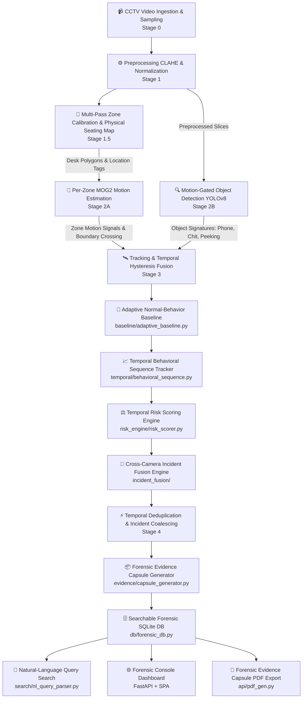
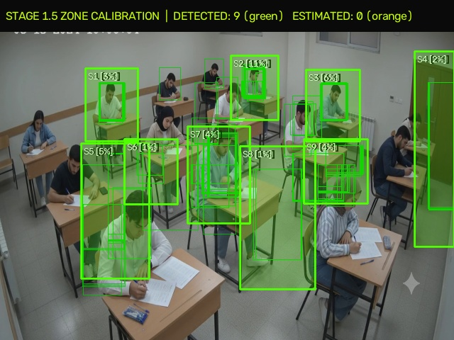
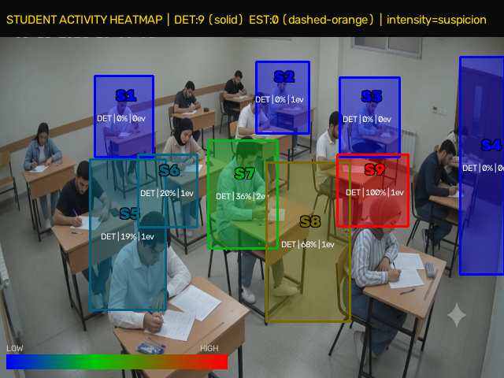

# 🛡️ DRISHTI AI — AI-Powered Examination Video Forensics Platform

> **Hackathon Solution for Problem Statement #2:** Offline Video Segmentation and ROI Detection Using Motion Estimation.  
> **Core Concept:** *"We don't just find motion. We convert hours of examination CCTV into ranked, explainable, cross-camera evidence."*

---

## 🎯 Executive Summary & Vision

**Drishti AI** transforms manual examination CCTV review into an automated, transparent, and explainable **Forensic Investigation Platform**. 

Manual review of multi-hour examination hall surveillance footage is tedious, subjective, and prone to fatigue. Drishti AI solves this by executing a decoupled offline AI pipeline that filters out environmental noise, models normal room baseline behavior, fuses multi-camera cross-viewpoint anomalies into prioritized incidents, and generates self-contained **Evidence Capsules** for disciplinary committees.

### ⚖️ Forensic Role & Disclaimer
Drishti AI is strictly an **investigation-support tool**. It never asserts guilt or makes definitive claims of academic dishonesty. All findings are classified as **Anomalous Activity / High-Risk Events** to direct human investigators to the most critical video intervals.

---

## 🏛️ Pipeline Architecture



---

## 🌟 Key USPs (Unique Selling Points)

### 1. 🧠 Adaptive Normal-Behavior Baseline (`baseline/`)
- Learns normal desk behavior (writing, posture adjustments, brief looking around) during an initial calibration window.
- Dynamically estimates moving $\mu_{\text{motion}}, \sigma_{\text{motion}}$, burst frequency, and direction change rates per desk.
- Flags sustained deviations using adaptive $Z$-scores rather than static thresholds.

### 2. 📈 Temporal Behavioral Sequence Analysis (`temporal/`)
- Analyzes sequences of actions over time rather than isolated frames.
- Models motion frequency, intensity, duration persistence, repetition cycles, and boundary reach.

### 3. ⚖️ Explainable Temporal Risk Scoring Engine (`risk_engine/`)
- Calculates a transparent score (0–100) with full mathematical factor attribution:
  - **Motion Intensity** (+0 to +25)
  - **Motion Repetition / Frequency** (+0 to +25)
  - **Duration Persistence** (+0 to +15)
  - **Directional Movement / Boundary Crossing** (+0 to +15)
  - **Prohibited / Anomalous Object Interaction** (+0 to +20)
  - **Cross-Camera Corroboration** (+0 to +10)
- Categorizes risk levels: `LOW (0-30)`, `MEDIUM (31-60)`, `HIGH (61-80)`, `CRITICAL (81-100)`.

### 4. 🔗 Cross-Camera Incident Fusion (`incident_fusion/`)
- Correlates multi-camera viewpoints and synchronized angles using timestamp proximity, camera IDs, and spatial zones.
- Merges concurrent multi-view triggers into unified incidents without duplicate alerts.

### 5. 📦 Forensic Evidence Capsules (`evidence/`)
- For every prioritized incident, automatically generates an **Evidence Capsule**:
  - Incident ID, duration, camera angles, and physical desk location.
  - Risk score with interactive factor breakdown bar.
  - **Pre-Event (-1.0s), During-Event, and Post-Event (+1.0s)** frame snapshots.
  - Localized desk heatmap & ROI crop.
  - Browser-playable annotated `.mp4` video clip.
  - Formal AI forensic explanation and 1-click PDF download.

### 6. 🎯 Investigation Priority Queue
- Ranks incidents by risk severity, confidence, duration, and corroboration so proctors review highest-risk events first.

### 7. 🔎 Natural-Language & Deterministic Video Search (`search/`)
- Sub-millisecond keyword and filter query engine:
  - *"Show all high-risk events"*
  - *"Show events involving mobile phone"*
  - *"Show peeking events"*
  - *"Show repeated movement events"*
  - *"Camera 2"*
  - *"Risk above 80"*
  - *"Cross-camera incidents"*

### 8. 📱 Object-Aware Analysis (YOLO Custom Model)
- Pluggable lightweight YOLO detector (`best.pt`) identifying: `person`, `phone`, `chit`, `hand`, `peeking`, `supplement-passing`.
- Combined with behavioral signals to minimize false positives.

### 9. 🔥 Dual Heatmaps (Global & Student Suspicion)
- **Global Hall Heatmap:** Optical motion accumulation over time.
- **Student Activity Heatmap:** Baseline-normalized suspicion score per calibrated desk polygon.

### 10. ⏱️ Interactive Multi-Camera Timeline
- Multi-track timeline chart mapping synchronized incidents across video duration with seek-to-event playback.

### 11. 🗄️ Searchable Forensic Database (`db/`)
- SQLite database storing structured metadata: `incidents`, `events`, `evidence_capsules`, `audit_logs`.

### 12. 🔒 Privacy by Design
- Anonymous Track IDs (`Track_001`, `Desk_S01`) and location-based tagging rather than biometric/facial identification.

---

## 📸 System Visualizations

### 1. Classroom Seating Map & Calibration Preview

> *Figure 1: Calibrated seating polygons. **Green solid borders** represent verified `DETECTED` zones with multi-frame confidence scores.*

---

### 2. Student Activity & Suspicion Heatmap

> *Figure 2: Time-aggregated student suspicion heatmap color-coded from low (blue/cyan) to high activity (red/orange).*

---

## 🚀 Quick Start & Installation

### 1. Requirements
- Python 3.10+
- FFmpeg (installed and available in system PATH)

### 2. Clone & Install
```bash
git clone https://github.com/djain28006/drishti_ai.git
cd drishti_ai
python -m venv .venv
# On Windows:
.venv\Scripts\activate
# On Linux/macOS:
source .venv/bin/activate

pip install -r requirements.txt
```

### 3. Launch Web Forensics Console
```bash
python -m uvicorn api.server:app --host 0.0.0.0 --port 8000
```
Open **`http://localhost:8000`** in your browser.

### 4. Run via CLI
```bash
python main.py --clean --input test2.mp4
```

---

## ⚡ Hackathon Demo Flow (5-Minute Walkthrough)

1. **Dashboard Overview (The Evidence Reduction Funnel):**
   - Demonstrate the funnel: `69 Raw Motion ROI Bursts` $\to$ `11 Noise-Filtered Events` $\to$ `10 Anomalies` $\to$ `10 Fused Incidents` $\to$ `Prioritized Capsules`.
2. **Priority Queue & Evidence Capsules:**
   - Click on the highest-risk incident card (`INC-4C9C4F`, Risk: 79/100).
   - Inspect the **Before / During / After temporal snapshots**, the **Risk Factor Breakdown Bar**, and play the **Annotated Video Clip**.
3. **Natural-Language Search:**
   - In the Search Console, click `"🔴 High-Risk Events"` or type `"peeking"` to instantly filter incidents.
4. **Synchronized Timeline & Heatmap:**
   - Navigate to the **Multi-Cam Timeline** and switch between **Student Suspicion** and **Raw Optical Motion** heatmaps.
5. **PDF Export:**
   - Click **Export Capsule PDF** to download a standardized examination integrity report.

---

## ⚠️ Known Limitations
- **Camera Occlusions:** Severe perspective obstruction (e.g. pillars or tall students blocking rear desks) may reduce detection confidence.
- **Lighting Extremes:** Drastic room lighting blackouts require CLAHE normalization warmup frames.
- **Object Resolution:** Prohibited object detection (tiny paper chits) depends on camera distance and resolution.

---

## 📄 License
Released under the MIT License for academic integrity research and surveillance forensics.
